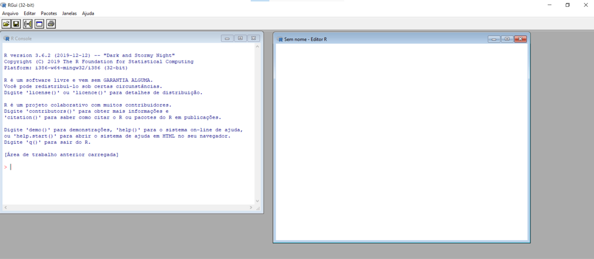
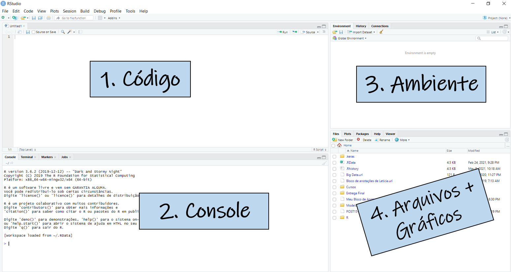
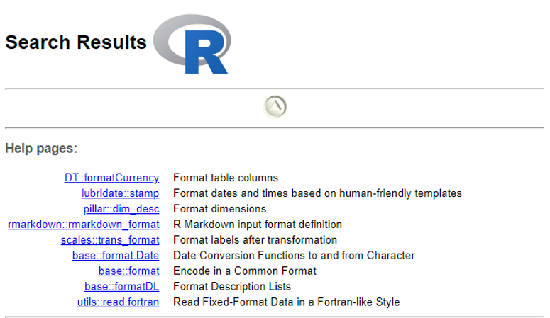
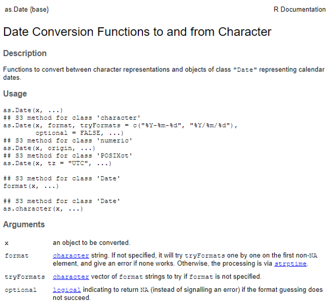
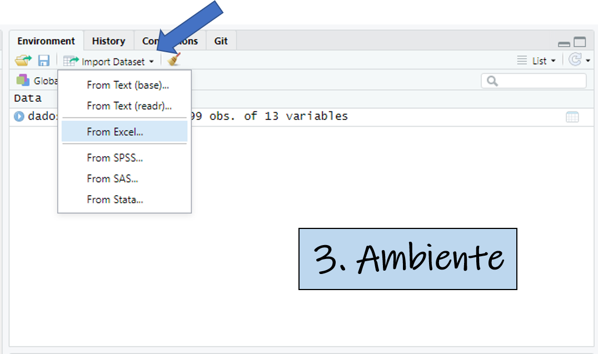

```{r include=FALSE}
library(dplyr)
```

# O que é o R?

- O R é uma linguagem de programação e também um software livre

- Fornece uma grande variedade de técnicas estatísticas e técnicas para visualização gráfica

- É altamente **extensível**

- Além de todas as funções que já são implementadas de forma nativa, você também pode usar os **pacotes** do R que são criados pela comunidade.

.center[]

---

# RStudio

RStudio é um software livre de ambiente de desenvolvimento integrado para **R**.

.center[]

---

# Forma mais básica de usar o R

O R pode ser usado para fazer contas como uma calculadora.

```{r echo=TRUE}
# Código
2 + 2
```

```{r echo=TRUE}
# Código
2 ^ 10
```

```{r echo=TRUE}
# Código
((2 ^ 10) / 8) * 3
```

---

# Funções

Assim como no excel, o R também têm funções implementadas. Por exemplo, a função `sum()`.  

Toda função recebe **argumentos** que serão usados para realizar o cálculo desejado.   
Mas como saber quais argumentos colocar na função ? Ou até qual função usar ?

--

<br />

### Ajuda no R
É muito fácil chamar ajuda pelo próprio R.

Quando você quiser encontrar uma função, você pode buscar por alguma palavra-chave
`help.search("format date")` que o R vai te mostrar possíveis funções que podem te atender. 

Caso você já saiba qual função usar e quer saber os argumentos, basta digitar:   
`?nome_da_funcao`

---
## Buscando pela palavra-chave

```{r eval=FALSE}
help.search("format date")
```

.center[]

---
## Buscando pela função

```{r eval=FALSE}
?as.Date
```

.center[]

---
# Objetos do R

**1. Vetores**: uma sequência de valores numéricos ou caracteres

--

**2. Matrizes**: coleção de vetores em linhas e colunas, em que todos os vetores tem o mesmo tipo (numério ou caracteres)

--

**3. Dataframe**: é o mesmo que uma matriz mas podemos ter tipos diferentes.   
Esse é o objeto que normalmente armazenamos os nossos dados. 

--

**4. Listas**: conjunto de vetores, dataframes ou matrizes. Não precisam ter o mesmo comprimento.  
A maior parte das funções retorna os resultados em listas. 

--

**5. Funções**: ferramentas que podemos usar para fazer os cálculos desejados.

---
class: title-slide, middle

## VETORES

---
## 1. Vetores

Para criar um vetor no R, basta criar um objeto usando 'c' (concatenar), e colocar os valores do vetor entre parênteses. O código abaixo cria vetor **familia** que contém os nomes dos integrantes da minha família como valores.

--

```{r echo=TRUE}
familia <- c("Cleide", "Elaine", "Rafael", "Letícia", "Amora", "Nutella")
```

--

Para acessar algum valor do vetor, basta chamar a posição que esse valor ocupa no vetor entre [].

--

```{r echo=TRUE}
familia[4]
```

--

Também é possível usar funções nos vetores.

--

```{r echo=TRUE}
idades_familia <- c(78, 53, 28, 27, 2, 2)
mean(idades_familia)
```

---
class: title-slide, middle

## MATRIZES

---
## 2. Matrizes

Matriz são coleções de vetores, então para criar uma matriz, podemos juntar os dois vetores criados no slide anterior. Para isso, usaremos a função `cbind()` (_column bind_).

--

```{r echo=TRUE}
matriz_familia <- cbind(familia, idades_familia)
matriz_familia
```

--

Assim como nos vetores, podemos acessar um valor da matriz usando as posições do objeto. Porém na matriz precisamos passar a linha e a coluna que queremos selecionar. 

.center[**M<sub>_linha, coluna_</sub>**]

---
## 2. Matrizes

1- Se quisermos ver a idade da Amora:
```{r echo=TRUE}
# Linha 5, Coluna 2
matriz_familia[5,2]
```

--

2- E se quisermos ver as duas colunas? Nome e idade?
```{r echo=TRUE}
# Linha 5, Colunas 1 e 2
matriz_familia[5,c(1,2)]
```

---
## 2. Matrizes

3- Para ver **todas** as colunas ou todas linhas, você pode omitir o número das linhas ou colunas. O código anterior poderia ser escrito da seguinte forma: 
```{r echo=TRUE}
# Linha 4, Todas as colunas
matriz_familia[4,]
```

--

```{r echo=TRUE}
# Coluna 1, Todas as linhas
matriz_familia[,1]
```

---
## 2. Matrizes

Também podemos fazer operações com matrizes.

1- Vamos pegar o máximo dos nossos nomes. 
```{r echo=TRUE}
# Máximo da Coluna 1, todas as Linhas
max(matriz_familia[,1])
```

--

2- Vamos pegar a média das nossas idades.
```{r echo=TRUE}
# Média da Coluna 2, todas as Linhas
mean(matriz_familia[,2])
```

--

Como o vetor com nossos nomes é do tipo **caracter**, quando juntamos com o vetor de idade para formar a matriz, o vetor de idades passou a ser **caracter** também, pois matrizes só podem ter um tipo de dado.   
.center[E é por isso que normalmente trabalhamos com **dataframes**!]

---
class: title-slide, middle

## DATAFRAMES

---
## 3. Dataframes

Dataframe é a mesma coisa que uma matriz, mas ele aceita vetores de tipos **diferentes**. Para juntar os dois vetores, dessa vez usaremos a função `data.frame()`. 
```{r echo=TRUE}
df_familia <- data.frame(familia, idades_familia)
df_familia
```

--

É possível manipular os dados pela posição dos objetos, assim como vimos nas matrizes, e também podemos selecionar as colunas de interesse utilizando o símbolo `$`.
.pull-left[
```{r echo=TRUE}
df_familia[,2]
```
]
.pull-right[
```{r echo=TRUE}
df_familia$idades_familia
```
]

--

.center[
Mas pra trabalhar no R, tem sempre que digitar os dados ? **Não!**
]

---
class: title-slide, middle

## IMPORTANDO DADOS PARA O R

---
# Importando dados 

Pode-se entrar com dados no R de diferentes origens. Por exemplo:

**1. txt**: arquivos texto usando a função `read.table()`

**2. csv**: arquivos csv usando a função `read.table()` ou `read.csv2()`

**3. xlsx**: arquivos excel usando a função `read_excel()` do pacote **readxl**

**4. BigQuery**: dados do BQ usando a função `bq_table_download()` do pacote **bigrquery**

.center[]

---
# dplyr

O **dplyr** é um dos melhores pacotes do R para manipulação de dados.   
Ele fornece um conjunto de verbos que ajudam a resolver os desafios mais comuns da manipulação de dados:

- **mutate**: para adicionar novas variáveis que são função de variáveis existentes
- **select**: selecionar apenas as variáveis de interesse
- **filter**: filtrar os casos que se encaixam em determinada condição
- **group_by**: agrupar os dados por determinadas variáveis
- **summarise**: sumariza vários valores a uma medida resumo
- **arrange**: muda a ordem das linhas


.center[]  
.caption[Ilustração de Allison Horst]

---
class: inverse, middle
# Estatística Básica

---
# Estatística Básica 

Para sabermos qual técnica estatística utilizar, e como interpretar os resultados, precisamos entender com que tipo de dado estamos lidando.

###  Tipos de Variáveis
### Quantitativas 
São as variáveis representadas por números (uma contagem, uma medida):
- **Discretas**: valores representam um conjunto finito ou enumerável. Ex: quantidade de filhos. 
- **Contínuas**: valores pertencem a um intervalo de números reais. Ex: peso das pessoas. 

### Qualitativas
São as variáveis que representam uma qualidade ou atributo, e são definidas por diversas categorias. 
- **Nominal**: quando não existe uma ordenação. Ex: sexo, cor do cabelo. 
- **Ordinal**: quando existe uma ordenação. Ex: escolaridade. 

---
# Análise Descritiva
As estatísticas descritivas são números ou medidas que têm como objetivo descrever o nosso conjunto de dados. 

### Medidas de Posição
Valor ao redor do qual os dados se distribuem.
- **Média**: média dos dados. É mais sensível aos valores da amostra, então é adequada a situações que os dados são distriuídos de forma mais uniforme. 
- **Mediana**: valor central do conjunto de dados.
- **Moda**: representa o valor mais frequente do conjunto de dados.

### Medidas de Dispersão
Medidas que indicam a variabilidade dos dados
- **Amplitude**: valor máximo menos o valor mínimo
- **Variância**: valor que representa o afastamento que os dados têm da média
- **Desvio Padrão**: é a raiz quadrada da variância

---
# Análise Descritiva

Para todas as variáveis quantitativas do nosso conjunto de dados, podemos olhar as medidas de posição usando a função `summary()`. 
E também podemos fazer um histograma usando a função `hist()`.
```{r echo=TRUE, fig.height = 3.7, fig.width = 3.7, fig.align='center'}
vetor_exemplo <- rnorm(n = 10000, mean = 0, sd = 1)
print(summary(vetor_exemplo))

hist(vetor_exemplo)
```

---

Também podemos olhar essas medidas, considerando uma variável categórica. Usando os verbos do pacote **dplyr**.
```{r}
# Gera um vetor aleatório com A,B,C
categorias_exemplo <- sample(LETTERS[1:3], 10000, replace=TRUE, prob=c(0.35, 0.25, 0.40))
df <- data.frame(vetor_exemplo, categorias_exemplo)

df %>% 
  dplyr::group_by(categorias_exemplo) %>% 
  dplyr::summarize(min = min(vetor_exemplo),
                   quartil_1 = quantile(vetor_exemplo, .25),
                   mediana = median(vetor_exemplo),
                   media = mean(vetor_exemplo),
                   quartil_3 = quantile(vetor_exemplo, .75),
                   max = max(vetor_exemplo)
  )
```

---
# Correlação

Correlação é o termo usado para determinar a relação de dois eventos. Em estatística, indica a força e direção do relacionamento **linear** entre duas ou mais variáveis. 

```{r}
# Gera um vetor aleatório com A,B,C
vetor_exemplo2 <- rnorm(n = 10000, mean = 3, sd = 7)
vetor_exemplo3 <- rnorm(n = 10000, mean = 10, sd = 13)
df <- data.frame(vetor_exemplo, vetor_exemplo2, vetor_exemplo3, categorias_exemplo)

cor(df %>% 
      select(vetor_exemplo, vetor_exemplo2, vetor_exemplo3))

```


---
## Variáveis Qualitativas

Para as variáveis qualitativas, durante a análise descritiva, normalmente usamos **tabelas de frequência** e **gráficos de barras** para conhecer essas variáveis. 

```{r echo=TRUE}
# Tabela de Frequência
table(df$categorias_exemplo)
```
```{r echo=TRUE, fig.height = 3.7, fig.width = 3.7}
# Gráfico de Barras 
barplot(table(df$categorias_exemplo))
```

